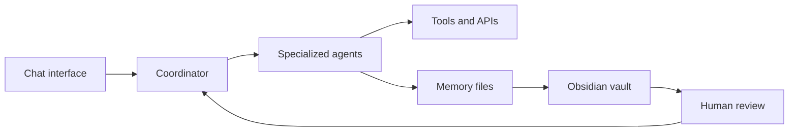
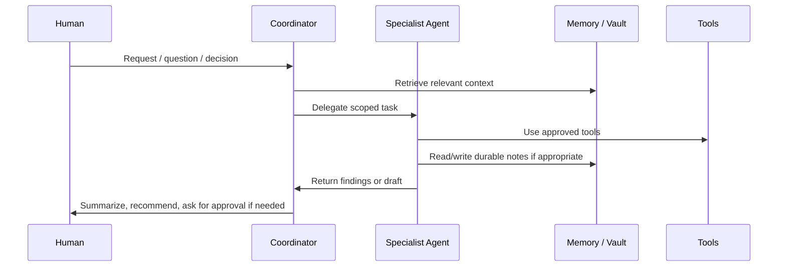

# Architecture

The stack is organized as a human-supervised agent system with persistent memory and project-specific workflows.

## Design goals

- Keep human judgment at the center.
- Separate roles so agents do not become an undifferentiated chatbot.
- Maintain durable context outside the model window.
- Use scheduled tasks for monitoring, not unchecked action.
- Keep the system explainable enough to audit and improve.

## Layers

### 1. Interface layer

A lightweight chat interface is used for interaction. The interface is intentionally simple: the complexity sits behind the scenes in roles, memory, tools, and workflows.

### 2. Orchestration layer

A coordinator agent handles routing, context recovery, and follow-through. Its job is not to know everything, but to know where work belongs.

### 3. Specialized agent layer

Agents are separated by mandate:

- diplomacy / AI governance;
- AI research;
- engineering;
- QA/security/operations;
- positioning/opportunities.

This separation reduces context pollution and makes accountability easier.

### 4. Tool layer

Tools may include search, file operations, code execution, repo inspection, deployment checks, and scheduled tasks. Tool access should be scoped by role and risk.

### 5. Memory layer

Memory is split into:

- short-term session context;
- daily logs;
- curated long-term notes;
- an Obsidian-compatible vault;
- project-specific documentation.

### 6. Automation layer

Scheduled agent runs handle recurring monitoring and maintenance. These are useful for routine information work, but constrained by governance rules.

### 7. Human decision layer

The human operator remains responsible for decisions, external communication, publication, and irreversible changes.

## Data flow

## Key architectural principle

The system is not optimized for maximum autonomy. It is optimized for reliable assistance under human control.
