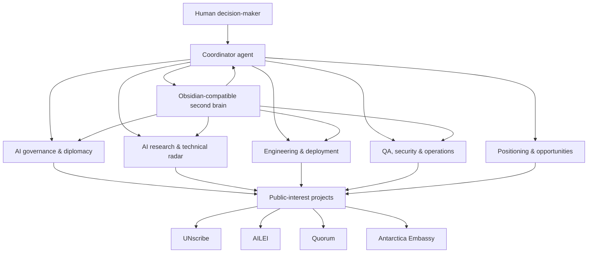

# AI Diplomacy Agent Stack

An experimental personal AI agent system for diplomacy, AI governance, research monitoring, and public-interest technology projects.

This repository documents how specialized AI agents can support high-context knowledge work: tracking AI governance developments, maintaining a policy-oriented second brain, monitoring public-interest technology projects, and assisting with analysis, drafting, QA, and implementation.

It is not a product, not a public service, and not an attempt to automate diplomatic judgment. It is a documented operating model for augmenting research, coordination, and technical prototyping while keeping human decision-making at the center.

## Why this exists

Diplomacy and AI governance now sit inside a fast-moving information environment:

- UN processes, negotiations, institutional timelines, and stakeholder positions evolve continuously.
- Technical AI capabilities change weekly.
- Public-interest digital tools require product, engineering, security, and communications work.
- Important context is often distributed across chats, documents, project repos, news, academic papers, and personal notes.

The goal of this stack is to create a lightweight private office for that environment: agents with clear roles, durable memory, scheduled monitoring, and human approval gates.

## System at a glance

## Core layers

1. **Agent cabinet** — specialized assistants with distinct mandates.
2. **Project layer** — concrete public-interest tools and prototypes.
3. **Automation layer** — scheduled briefings, monitoring, QA, and knowledge maintenance.
4. **Second brain layer** — an Obsidian-compatible Markdown knowledge graph.
5. **Governance layer** — human approval, role separation, and safety constraints.

## Agent cabinet

| Agent role | Function |
|---|---|
| Coordinator | Routes work, maintains context, orchestrates other agents, keeps the system coherent. |
| AI governance & diplomacy | Monitors UN/AI governance developments, supports policy analysis, tracks institutional processes. |
| AI research radar | Tracks technical AI developments, model releases, research trends, and educational explainers. |
| Engineering lead | Builds, debugs, deploys, and maintains prototypes and technical systems. |
| QA / security / operations | Audits system health, reviews security posture, checks automations and operational reliability. |
| Positioning / opportunities | Helps frame projects, identify audiences, clarify narratives, and scan public-interest opportunities. |

Personal health, family, private finance, credentials, and unrelated personal routines are intentionally out of scope for this public description.

## Reference projects

This stack is anchored in concrete projects rather than abstract agent demos:

- **UNscribe** — AI-assisted transcription and diplomatic cable generation for UN meetings.  
  <https://www.unscribe.org>

- **AILEI — Artificial Intelligence Language Evaluation Index** — dashboard evaluating language equity across AI models.  
  <https://ailei-dashboard.vercel.app/>

- **Quorum** — UN Security Council simulation and diplomatic reasoning environment.  
  <https://quorum-sc.vercel.app/>

- **Antarctica Embassy** — virtual autonomous embassy / experimental diplomatic interface.  
  <https://soleria-embassy.vercel.app>

## Example workflows

- Morning AI governance briefing.
- Monitoring developments around UN AI governance processes.
- Tracking model releases and AI research trends.
- Reviewing project health, deployments, and QA status.
- Maintaining a project wiki and knowledge graph.
- Drafting and stress-testing policy analysis.
- Turning raw notes into durable project, concept, and entity pages.

See [`WORKFLOWS.md`](WORKFLOWS.md) for examples.

## Second brain

The system uses an Obsidian-compatible Markdown vault as the human-readable knowledge layer. Agents can help maintain the vault, but the vault remains portable plain text.

The structure follows an LLM Wiki Pattern:

- raw activity is captured in memory logs;
- agents distill durable knowledge into wiki pages;
- pages are organized as projects, concepts, and entities;
- Obsidian provides graph view, backlinks, and human review;
- agents can retrieve context from the same files.

See [`SECOND_BRAIN.md`](SECOND_BRAIN.md).

## Automation philosophy

Automations are useful, but they are treated as operational infrastructure, not autonomous authority.

Scheduled jobs can monitor, summarize, check, and draft. They should not publish, send official communications, modify public systems, or take irreversible actions without human approval.

See [`AUTOMATIONS.md`](AUTOMATIONS.md).

## Governance and safety

The system is designed around a simple rule:

> Agents may augment research and operations; humans remain the decision layer.

Key constraints:

- no public communication without explicit human approval;
- no irreversible infrastructure changes without confirmation;
- no secrets or private credentials in the public repo;
- role separation between analysis, implementation, QA, and approval;
- preference for read-only monitoring where possible;
- logs and memory are treated as sensitive by default.

See [`GOVERNANCE.md`](GOVERNANCE.md) and [`SECURITY.md`](SECURITY.md).

## What this repository is not

- Not a plug-and-play product.
- Not a claim that AI can replace diplomats, analysts, or engineers.
- Not a dump of private prompts, credentials, logs, or production configuration.
- Not an official institutional system.

It is a documented experiment in agentic work infrastructure.

## Status

Draft public documentation. Sanitized for publication.

## License

This documentation is shared under [CC BY 4.0](LICENSE.md).
