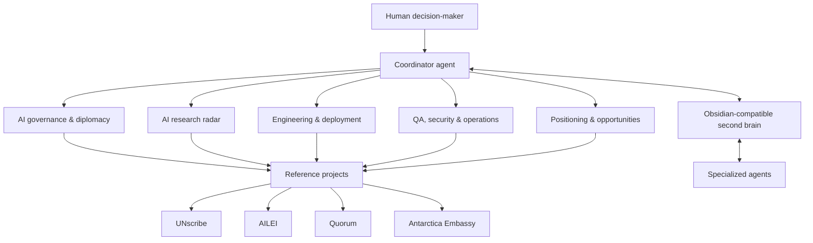

# AI Diplomacy Agent Stack

> A documented experiment in using specialized AI agents as a private office for diplomacy, AI governance, research monitoring, and public-interest technology projects.

This repository explains an agentic work setup built around a simple idea: AI agents are most useful when they have clear roles, durable memory, concrete projects, and human approval boundaries.

It is not a product, not an official system, and not a claim that AI can replace diplomatic judgment. It is a practical operating model for augmenting research, coordination, drafting, QA, and technical prototyping.

## Why this exists

Diplomacy and AI governance now operate inside a dense, fast-moving information environment:

- UN processes, negotiations, institutional timelines, and stakeholder positions evolve continuously.
- Technical AI capabilities change weekly.
- Public-interest digital tools require product, engineering, security, and communications work.
- Important context is scattered across chats, documents, project repos, news, papers, notes, and meetings.

The stack creates a lightweight **digital policy office**: specialized agents, a shared second brain, scheduled monitoring, and explicit governance rules.

## One-minute overview



## Core layers

| Layer | Purpose |
|---|---|
| **Agent cabinet** | Specialized assistants with distinct mandates. |
| **Project layer** | Concrete public-interest tools and prototypes. |
| **Automation layer** | Recurring monitoring, briefings, QA, and knowledge maintenance. |
| **Second brain layer** | Obsidian-compatible Markdown knowledge graph. |
| **Governance layer** | Human approval, role separation, and safety constraints. |

## Agent cabinet

| Agent role | Function |
|---|---|
| **Coordinator** | Routes work, maintains context, orchestrates agents, keeps the system coherent. |
| **AI governance & diplomacy** | Monitors UN/AI governance developments, supports policy analysis, tracks institutional processes. |
| **AI research radar** | Tracks model releases, capability shifts, papers, benchmarks, and technical debates. |
| **Engineering lead** | Builds, debugs, deploys, and maintains prototypes and technical systems. |
| **QA / security / operations** | Audits system health, reviews security posture, checks automations and operational reliability. |
| **Positioning / opportunities** | Refines narratives, audiences, use cases, and public-interest opportunities. |

Personal health, family, private finance, credentials, and unrelated personal routines are intentionally out of scope for this public description.

## Reference projects

This stack is anchored in concrete projects rather than abstract agent demos:

| Project | What it is | Link |
|---|---|---|
| **UNscribe** | AI-assisted transcription and diplomatic cable generation for UN meetings. | <https://www.unscribe.org> |
| **AILEI** | Artificial Intelligence Language Evaluation Index: language equity across AI models. | <https://ailei-dashboard.vercel.app/> |
| **Quorum** | UN Security Council simulation and diplomatic reasoning environment. | <https://quorum-sc.vercel.app/> |
| **Antarctica Embassy** | Virtual autonomous embassy / experimental diplomatic interface. | <https://soleria-embassy.vercel.app> |

## Example workflows

- Morning AI governance briefing.
- Monitoring UN AI governance processes and institutional developments.
- Tracking model releases and AI research trends.
- Reviewing project health, deployments, and QA status.
- Maintaining a project wiki and knowledge graph.
- Drafting and stress-testing diplomatic analysis.
- Turning raw notes into durable project, concept, and entity pages.

See [`WORKFLOWS.md`](WORKFLOWS.md).

## Second brain

The system uses an Obsidian-compatible Markdown vault as the human-readable knowledge layer. Agents can help maintain the vault, but the vault remains portable plain text.

The structure follows an **LLM Wiki Pattern**:

1. raw activity is captured in memory logs;
2. agents distill durable knowledge into wiki pages;
3. pages are organized as projects, concepts, and entities;
4. Obsidian provides graph view, backlinks, and human review;
5. agents retrieve context from the same files.

See [`SECOND_BRAIN.md`](SECOND_BRAIN.md) and [`second-brain/`](second-brain/).

## Automation philosophy

Automations are useful, but they are operational infrastructure, not autonomous authority.

Scheduled jobs can monitor, summarize, check, and draft. They should not publish, send official communications, modify public systems, or take irreversible actions without human approval.

See [`AUTOMATIONS.md`](AUTOMATIONS.md).

## Governance and safety

The system is designed around a simple rule:

> Agents may augment research and operations; humans remain the decision layer.

Key constraints:

- no public communication without explicit human approval;
- no irreversible infrastructure changes without confirmation;
- no secrets or private credentials in the public repo;
- role separation between analysis, implementation, QA, and approval;
- preference for read-only monitoring where possible;
- logs and memory are treated as sensitive by default.

See [`GOVERNANCE.md`](GOVERNANCE.md) and [`SECURITY.md`](SECURITY.md).

## Repository map

```txt
.
├── README.md              # Overview
├── ARCHITECTURE.md        # System architecture
├── AGENTS.md              # Agent roles
├── PROJECTS.md            # Reference projects
├── WORKFLOWS.md           # Representative workflows
├── AUTOMATIONS.md         # Scheduled agent run philosophy
├── SECOND_BRAIN.md        # Obsidian / knowledge graph layer
├── GOVERNANCE.md          # Human-in-the-loop model
├── SECURITY.md            # Public repo safety rules
├── examples/              # Sanitized example workflows
├── templates/             # Reusable templates
├── diagrams/              # Mermaid diagrams
└── second-brain/          # Public-safe Obsidian-style sample vault
```

## What this repository is not

- Not a plug-and-play product.
- Not a dump of private prompts, credentials, logs, or production configuration.
- Not an official institutional system.
- Not a claim that AI agents negotiate, decide, or represent anyone autonomously.

It is a documented experiment in agentic work infrastructure.

## Status

Public documentation draft, sanitized for publication.

## License

This documentation is shared under [CC BY 4.0](LICENSE.md).
