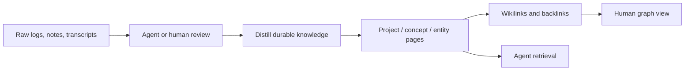

# Second Brain / Obsidian Knowledge Graph

The stack uses an Obsidian-compatible Markdown vault as the human-readable knowledge layer.

The purpose is not to store everything. The purpose is to turn important recurring context into a living knowledge graph that both humans and agents can use.

## Why Obsidian

Obsidian works well for this because it is:

- **local-first** — notes remain plain files;
- **portable** — Markdown survives any app migration;
- **graph-native** — backlinks and wikilinks reveal relationships;
- **human-readable** — the vault is not just an agent database;
- **agent-readable** — the same files can be searched and summarized by agents.

## The LLM Wiki Pattern

The vault follows an LLM Wiki Pattern:



## Knowledge lifecycle

1. **Capture** — daily logs, project updates, research notes, and decisions are captured somewhere durable.
2. **Triage** — ephemeral items stay in logs; durable items become wiki pages.
3. **Distill** — pages summarize what matters, not every detail.
4. **Link** — related projects, institutions, concepts, and agents are connected with wikilinks.
5. **Review** — humans periodically correct, prune, and promote important notes.
6. **Retrieve** — agents consult the vault instead of relying only on chat context.

## Suggested vault structure

```txt
second-brain/
├── Home.md
├── README.md
├── proyectos/
│   ├── UNscribe.md
│   ├── AILEI.md
│   ├── Quorum.md
│   └── Antarctica-Embassy.md
├── conceptos/
│   ├── LLM-Wiki-Pattern.md
│   ├── Agentic-Diplomacy.md
│   └── AI-Governance.md
├── entidades/
│   ├── Coordinator-Agent.md
│   ├── Governance-Agent.md
│   ├── Research-Agent.md
│   ├── Engineering-Agent.md
│   └── Ops-Agent.md
├── inbox/
└── attachments/
```

## What belongs in the vault

- project state;
- durable concepts;
- people and institutions where relevant;
- decisions and rationales;
- research summaries;
- workflows;
- open loops;
- lessons learned.

## What does not belong in a public vault

- credentials;
- chat IDs;
- personal data;
- sensitive logs;
- confidential material;
- raw transcripts unless public and cleared;
- production configuration.

## Human-agent division of labor

Agents can maintain the vault. Humans decide what is important, correct, shareable, and strategically relevant.

A useful rule of thumb:

> Agents generate and connect notes; humans curate judgment.
